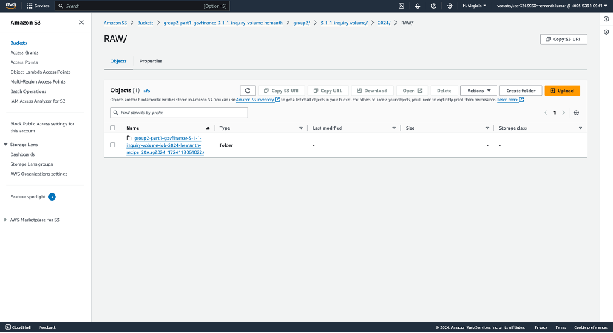
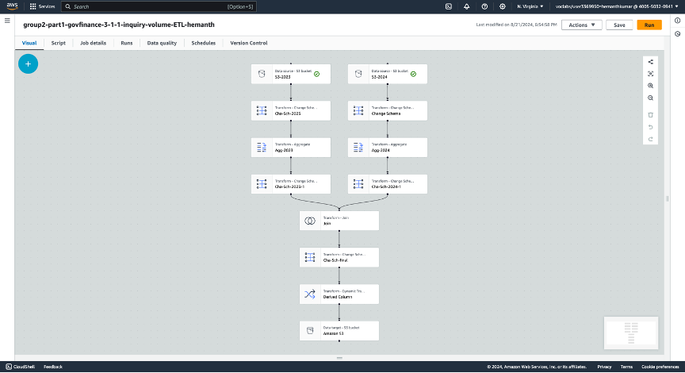
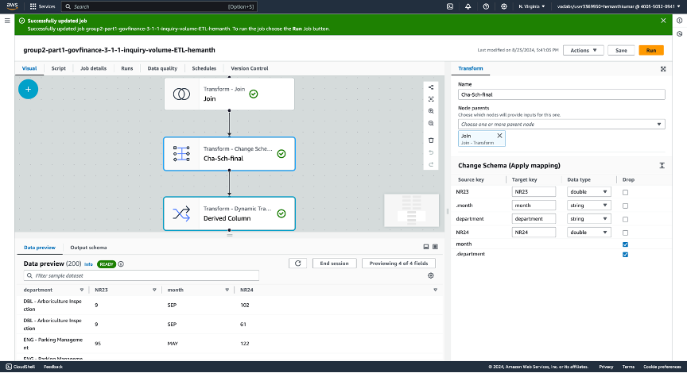
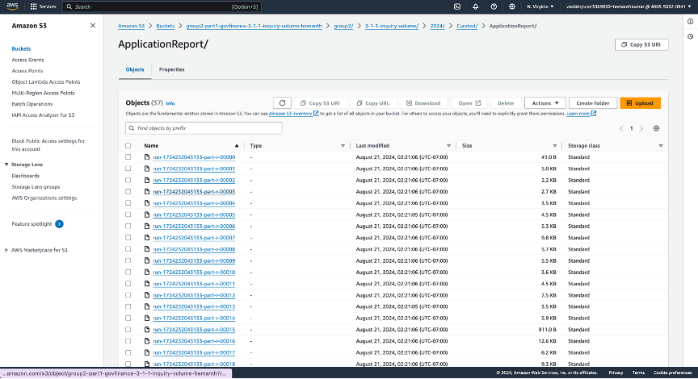
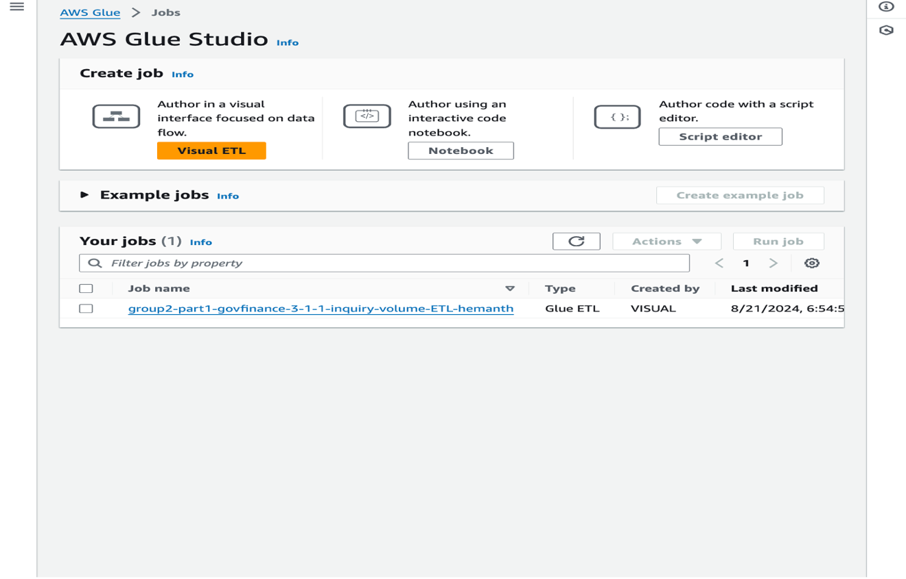
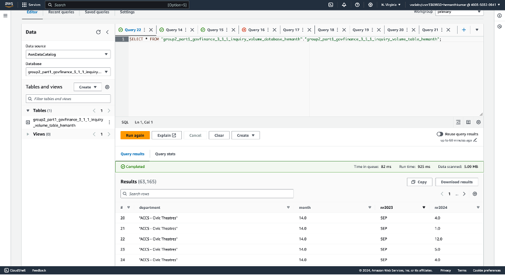
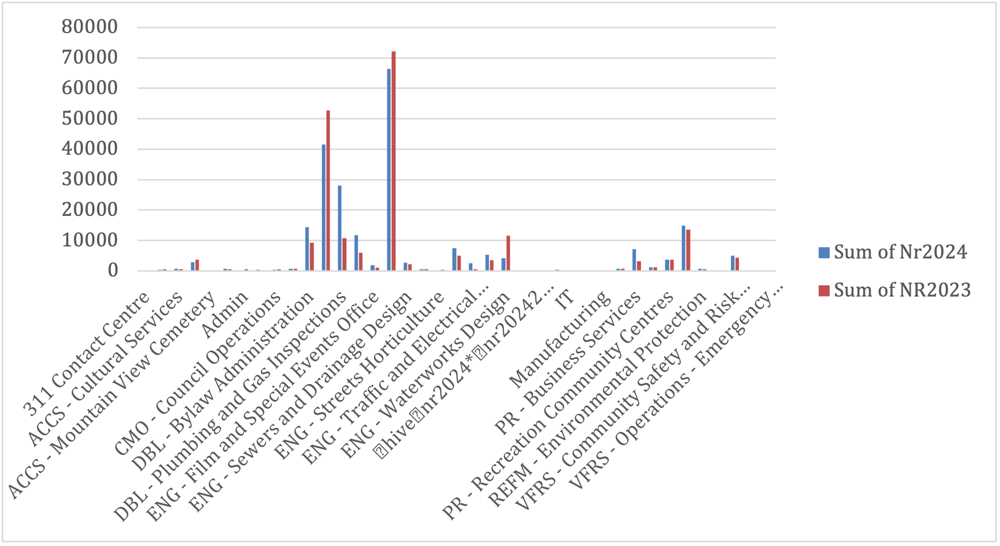

# AWS Data Analytic Platform for The City of Vancouver

## Implementation and Analysis of 3-1-1 Inquiry Volumes Using AWS

### Introduction
The City of Vancouver has migrated its data processing to Amazon Web Services (AWS) to optimize the speed and quality of data analysis for better decision-making. The 3-1-1 inquiry system is a crucial public service that allows citizens to report issues, ask questions, and request services from various city departments. This project establishes a Data Analytics Platform (DAP) on AWS for sourcing, storing, processing, and analyzing 3-1-1 inquiry volumes to improve resource allocation and service delivery.


---

## Part 1: DAP Design and Implementation

### 1. Data Analytical Question Formulation
Key questions driving the analysis include:
- To which departments do citizens most frequently report inquiries?
- What are the monthly trends in inquiry volumes?
- How does the distribution of inquiry volumes vary by year?

### 2. Data Discovery
Data was sourced from the City of Vancouver's 3-1-1 inquiry volume dataset available at [OpenData Vancouver](https://opendata.vancouver.ca/explore/dataset/3-1-1-inquiry-volume/information/?disjunctive.department&disjunctive.type&disjunctive.channel).

### 3. Storage Design
AWS S3 was used for data storage with three distinct buckets:
- **Raw Bucket**: Stores unprocessed data.
- **Landing Bucket**: Contains data post-initial processing and staging.
- **Curated Bucket**: Holds processed data ready for analysis.

### 4. Data Preparation
AWS DataBrew was used to clean and transform the data, applying standardization and filtering irrelevant data points.


### 5. Data Injection
The cleaned data was ingested into the S3 Raw bucket for storage and further processing.


### 6. Data Pipeline Design
AWS Glue was employed to create a data pipeline for ETL (Extract, Transform, Load) processes, ensuring the data flows efficiently to the desired destinations.



### 7. Data Cleaning
Data cleaning involved removing null values and resolving formatting issues using AWS DataBrew.

### 8. Data Structuring
The data was restructured by the department and monthly trends to fit the analytical questions posed at the beginning of the project.



### 9. Data Pipeline Implementation
AWS Glue Jobs were set up to ensure the correct transformation and loading of data into the designated S3 buckets.




### 10. Data Analysis
AWS Athena was utilized for SQL queries to analyze the data. For example, the following query was executed to retrieve relevant information:
```sql
SELECT FROM "group2_part1_govfinance_3_1_1_inquiry_volume_database_hemanth"."group2_part1_govfinance_3_1_1_inquiry_volume_table_hemanth";
```


### 11.Data Visualization
The comparison of inquiry volumes between 2023 and 2024 was visualized to analyze departmental resource allocation and performance. This was critical for stakeholders to monitor and report on department performance.


### 12.Data Publishing
An AWS EC2 instance was deployed to publish the analysis results, enabling remote access for stakeholders.


## Part 2: Data Protection, Governance, and Monitoring

### 1. Data Protection
Ensuring the security of the data was a top priority. The following AWS services were used to protect the data:
- **S3 Bucket Policies**: Strict access control measures were enforced to limit access to the data stored in the S3 buckets.
- **S3 Encryption**: AWS Key Management Service (KMS)-based encryption was enabled for all data stored in the S3 buckets, ensuring data security both at rest and in transit.
- **Data Replication**: Data replication across different AWS regions was implemented to provide redundancy and disaster recovery, ensuring high availability of the data in case of regional failures.

### 2. Data Governance
AWS CloudTrail was leveraged to manage data governance by logging all API requests and tracking changes in the AWS environment. CloudTrail's multi-region support ensured that governance was applied comprehensively across all regions, providing full visibility into system activity and ensuring compliance with the data protection policies.

### 3. Data Monitoring
To monitor the health and performance of the system, AWS CloudWatch was employed. Several key metrics were tracked through custom CloudWatch dashboards:
- **Estimated Charges**: Monitored cost variations associated with S3 storage and other AWS services used in the project.
- **Bucket Size (in Bytes)**: Tracked the growth of data storage over time to ensure optimal resource management and forecasting future storage needs.
- **Data Transfer and Query Metrics**: Tracked data transfer rates and query performance to identify potential bottlenecks in the system.
  
### Screenshots and Visuals
Several screenshots were captured to visualize key configurations:
- **S3 Bucket Management and Replication Rules**: Demonstrates the lifecycle management and replication configurations used for redundancy and disaster recovery.
- **CloudTrail Logging and Governance**: Shows how CloudTrail was configured to log API requests and track changes across all AWS services involved in the project.
- **CloudWatch Dashboard**: Highlights critical metrics, including estimated charges and bucket size, for real-time system monitoring and cost management.

### Summary of Insights
The governance and monitoring components of this project provided several key insights:
- **Security and Data Integrity**: Data security was maintained using AWS's advanced security features, ensuring the integrity and confidentiality of the data.
- **Proactive Monitoring**: Real-time insights into system performance and costs enabled proactive management of resources, reducing the risk of unexpected cost overruns or system failures.
- **Data Governance Compliance**: Comprehensive tracking of all activities and changes in the system ensured that governance and compliance requirements were met without compromising operational efficiency.

### Conclusion
The governance, protection, and monitoring setup for the AWS Data Analytic Platform ensured that the City of Vancouver could safely and securely manage its 3-1-1 inquiry data while maintaining compliance with all necessary security and governance standards. The proactive monitoring using CloudWatch and the comprehensive logging through CloudTrail allowed stakeholders to maintain control over both the security and performance of the system, ensuring sustainable and efficient data processing for future use.


